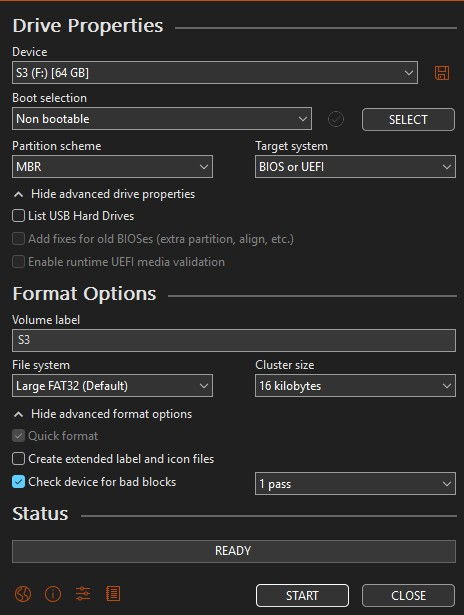

# S3 Proffie Configs

Based on S3 Preconfiguration 5 here <https://sabertrio.com/pages/support>.

## [ProffieOS Style Editor](https://nosloppy.github.io/ProffieOS-StyleEditor-1)

## [ProffieOS7 Style Library](https://www.fett263.com/fett263-proffieOS7-style-library.html#fett263)

## Documentation

### Settings for formatting SD Card using Rufus:

1) Get Rufus here https://rufus.ie/en/#download

2) Settings:

### Install STM32 driver and Arduino

Follow along here <https://pod.hubbe.net/proffieboard-setup.html>.

Open ProffieOS folder in Arduino, plug in Proffie board, select the COM port and select Proffieboard 2 or 3, upload. (compiling takes a little while)

### Scripts

* CLONE.bat - used to copy smoothsw and config INI's into every subfolder of "SD CARD". If you add new fonts you can run the bat to sync the configs to those folders before copying to the SD card.